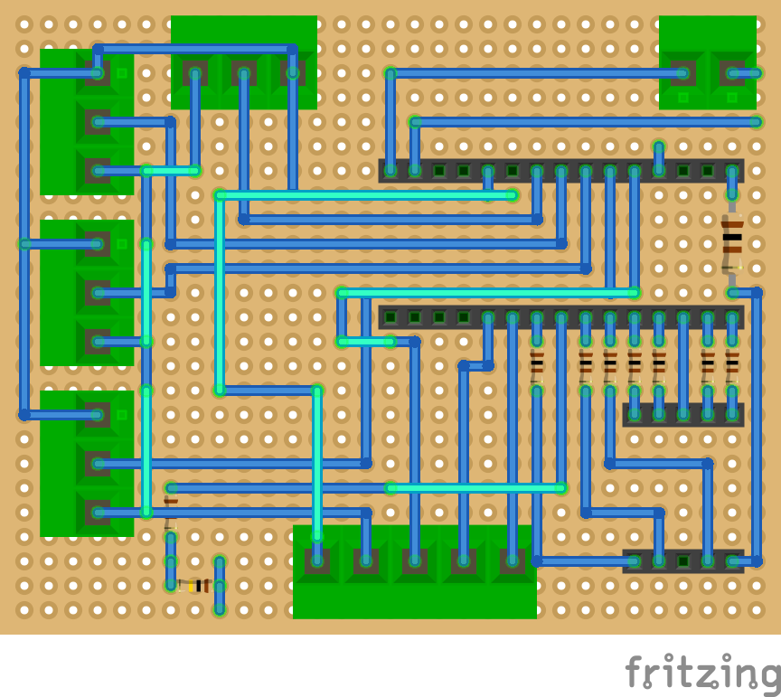

<!-- omit in toc -->
# TU-DO Disco

A custom DIY RGB dimmer for the TU-DO cafe.

- [Features](#features)
- [Building](#building)
  - [Components](#components)
  - [Perfboard layout](#perfboard-layout)
  - [Configuring, Compiling and flashing the firmware](#configuring-compiling-and-flashing-the-firmware)
- [Usage](#usage)
  - [General usage](#general-usage)
  - [Patch bank](#patch-bank)
    - [Loading/Selecting patches](#loadingselecting-patches)
    - [Saving patches](#saving-patches)
  - [Setting via USB](#setting-via-usb)
    - [Setting RGB only](#setting-rgb-only)
    - [Setting RGB and the main light](#setting-rgb-and-the-main-light)
    - [Retrieving the current color](#retrieving-the-current-color)
- [Documentation](#documentation)

## Features

The TU-DO dimmer can control all three color channels of an RGB LED strip as well as the brightness of a main 12V white LED strip using a set of 4 rotary potentiometers. In addition to satisfying the basic features a lights dimmer, the device also offers a 10-slot patch bank to store light any desired "patches"/configuration. The stored patches may then be loaded. Finally, one last touch that has been added is the option to program the LED strips do a desired HTML color code via USB serial communication.

## Building

### Components

|Component|Quantity|Description|
|---------|--------|-----------|
|Arduino Nano|1|The dimmer firmware runs on an Arduino Nano|
|WS2812 Led Strip|1|The WS2812 is the RGB LED strip our choice. The number of "pixels" on the strip must be specified in the [config.h](src/config.h) file. Support for non-addressable RGB strips is planned to be added.|
|Main LED Strip|1|The main strip can be any desired LED strip. If no main strip is used, uncomment the `NO_MAIN_STRIP` define directive.|
|Perfboard (At least 31 x 25)|1|Provided the simplicity of this porject, designing a PCB is not planned. A perfboard layout for the dimmer is provided below|
|IRF 630 N-Channel Mosfet|1|The IRF630 is used to drive the main light. Any other N-type MOSFET with the same lead assignments as the IRF 630 can be used in place|
|10k linear potentiometer|4|The potentiometers are used to adjust the lights. 10k pots are recommended, but all linear pots in the 1k to 100k range should work|
|KY-040 Rotary Encoder|1|The rotary encoder is used to switch between- and save patches|
|14,2mm Common Anode 7-Segment display|1|The 7-segment display displays the current patch. Using a common cathode display is possible, but will require `SEV_SEG_COMMON_MODE` to be set to `COMMON_CATHODE` in the [config.h](src/config.h) file.|
|Single row 15 pins 2.54mm female header|2|Two single row 15 pins female headers may be used instead of soldering the Arduino nano directly to the board|
|Single row 5 pins 2.54mm female header|2|Two singlerow 5 pins female headers may be used instead of soldering the 7-segment display directly to the board|

In total the components should be available for less than 25EUR.

All provided components above are based on the perfboard layout below. The project has been written for the Arduino Nano, but will work with little to no change on the Arduino UNO and should be easily portable to other platforms by doing some slight modifications to the firmware. The configuration header in [src/config.h](src/config.h) stores firmware parameters, including pin mappings

### Perfboard layout

Fully assembled (top view):


Terminals, Headers, Resistors and wires only (top view)


Wires Only with jumpers included (top view)


Bottom wires only (top view)


Bottom wires only (bottom view)


### Configuring, Compiling and flashing the firmware

The following Arduino Libraries are required for the firmware:

- [NeoPixelBus](https://github.com/adafruit/Adafruit_NeoPixel)
- [Paul Stoffregen's encoder library](https://github.com/PaulStoffregen/Encoder)

The firmware has been written using the [Platformio IDE](https://platformio.org/platformio-ide) and can be easily imported from the Platformio home menu.

Alternatively, the source code can be imported into the Arduino IDE. In order to import the project into the Arduino IDE, rename the `src/` directory to `main/` and rename `main.cpp` to `main.ino`. In the Arduino IDE go to `File > Open` and import the `main.ino` file and set the Arduino Nano as the target device.

Before compiling and uploading the firmware, ensure the the firmware parameters in the [config.h](src/config.h) file are configured to your hardware setup (ex. number of LEDs/Pixels on the RGB strip).

## Usage

### General usage

The device offers a total of 4 potentiometers to control the lights, three for the RGB strip and one to control the brightness of the white main light.

### Patch bank

A total of 10 save slots are provided to permanently store a desired light patch/configuration. **Upon device boot, the first (0th) patch is always loaded.**


#### Loading/Selecting patches

Loading the next or previous patch is achieved using a rotary encoder. By turning the rotary encoder to the right, the next patch is loaded, contrary, turning it to the left will select the previous patch. When a new patch has been selected, the patch is applied to the lights and the 7-Segment LED indicator will display the currently selected save slot for a brief time. As soon as the potentiometers are turned, the loaded configuration is discarded and the LEDs are once again set by the potentiometer values.

#### Saving patches

To save the current lights configuration to the currently selected save slot, press down the rotary encoder. The 7-Segment patch indicator will flash the currently selected save slot, confirming that the current patch has been saved.


### Setting via USB

As mentioned above, the lights may also be programmed via USB serial communication by providing a HTML color code.

#### Setting RGB only

To only program the RGB lights, a typical HTML/Hex color code in the form of `#AABBCC` is send via the Serial console.

Example, setting the RGB strip to red:
```
#FF000
```

The hex characters are case insensitive and the preceding `#` sign must be provided!

#### Setting RGB and the main light

Should one desire to also set the brightness of the main light, an additional byte (two hex character) is added to the HTML color code, controlling the brightness.

Example, disabling RGB lights and setting the Main light to full brightness:
```
#000000FF
```

Once again, the hex characters are case insensitive and the preceding `#` sign must be provided!

The light will maintain their programmed value until potentiometer movement is detected.

#### Retrieving the current color

One may also retrieve information regarding the current lights configuration by simply sending the `g` command via the serial console.

Example:
```
g
Current Color: #AABBCCDD
R: 170
G: 187
B: 204
M: 221
```

## Documentation

TUDO :)